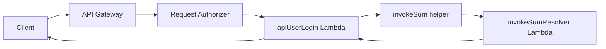

# Serverless TypeScript Boilerplate

> A clean AWS Lambda starter for building small, typed, service-oriented APIs with Serverless Framework, TypeScript, esbuild, request authorization, and Lambda-to-Lambda resolver calls.


## What This Gives You

This boilerplate is designed for fast-moving serverless projects that still need structure from day one.

- **TypeScript-first Lambda handlers** with typed request and response boundaries.
- **Serverless Framework v3** configuration written in TypeScript.
- **esbuild bundling** for small, fast Lambda artifacts.
- **API Gateway request authorizer** with JWT verification.
- **Reusable handler wrapper** that merges path params, query params, and JSON body into a single `data` object.
- **Lambda resolver pattern** for splitting API-facing handlers from internal business operations.
- **Local resolver execution** through `sls invoke local` when `NODE_ENV=dev`.
- **AWS Lambda invocation** for production resolver calls through `@aws-sdk/client-lambda`.
- **Path aliases** for cleaner imports such as `@lib/*` and `@constants/*`.

## Architecture



The API handler stays thin: it receives normalized request data, reads authenticated context, and delegates internal work to a resolver Lambda.

## Project Structure

```text
.
├── src
│   ├── authorizer.ts
│   ├── constants
│   │   └── service.const.ts
│   ├── libs
│   │   ├── invoke-function.lib.ts
│   │   └── lambda-handler.lib.ts
│   └── services
│       └── user-service
│           ├── handlers
│           │   ├── api
│           │   │   └── user
│           │   │       └── login.ts
│           │   ├── invokers
│           │   │   └── sum.invoker.ts
│           │   └── resolvers
│           │       └── sum.resolver.ts
│           ├── interfaces
│           ├── serverless.ts
│           └── types
├── __test
│   └── event.json
├── package.json
├── tsconfig.json
└── yarn.lock
```

## Requirements

- Node.js 20+
- Yarn
- AWS credentials configured locally for deploys
- Serverless Framework dependencies installed from this project

## Quick Start

Install dependencies:

```bash
yarn install
```

Set local environment variables:

```bash
export NODE_ENV=dev
export JWT_SECRET=local-secret
export AWS_REGION=eu-central-1
```

Enter the service directory:

```bash
cd src/services/user-service
```

Serverless resolves handlers from the directory that contains `serverless.ts`, so service commands should be run from this folder.

Invoke the sample resolver locally:

```bash
yarn sls invoke local \
  --function invokeSumResolver \
  --data '{"a":10,"b":25}'
```

Invoke the API handler with the sample event:

```bash
yarn sls invoke local \
  --function apiUserLogin \
  --path __test/event.json
```

## Deploy

Deploy the user service:

```bash
yarn sls deploy \
  --stage dev \
  --region eu-central-1
```

Remove the deployed stack:

```bash
yarn sls remove \
  --stage dev \
  --region eu-central-1
```

## Environment Variables

| Variable | Required | Used By | Description |
| --- | --- | --- | --- |
| `JWT_SECRET` | Yes | `src/authorizer.ts` | Secret used to verify bearer JWTs. |
| `NODE_ENV` | Local only | `src/libs/invoke-function.lib.ts` | Set to `dev` to invoke resolvers locally with Serverless. |
| `AWS_REGION` | AWS/runtime | AWS SDK Lambda client | Region used by the Lambda client. |

## Request Flow

1. API Gateway receives the request.
2. The request authorizer reads `Authorization: Bearer <token>`.
3. A valid JWT adds `userId` to the Lambda authorizer context.
4. `lambdaHandler` normalizes request input into `{ data, ctx }`.
5. The API handler calls a typed invoker.
6. The invoker calls a resolver locally in development or through AWS Lambda in deployed environments.
7. The handler returns a JSON API Gateway response.

## Adding A New Resolver

1. Add request and response types in `src/services/<service>/types`.
2. Create a resolver in `src/services/<service>/handlers/resolvers`.
3. Create an invoker in `src/services/<service>/handlers/invokers`.
4. Register the resolver in the service `serverless.ts`.
5. Call the invoker from an API handler or another resolver.

Example naming pattern:

```text
handlers/resolvers/create-user.resolver.ts
handlers/invokers/create-user.invoker.ts
functions.createUserResolver
invokeCreateUser(...)
```

## Core Conventions

- Keep API handlers focused on transport concerns.
- Put business operations behind resolver Lambdas.
- Keep shared Lambda utilities in `src/libs`.
- Keep stack and function names in `src/constants/service.const.ts`.
- Use path aliases for stable imports instead of long relative paths.
- Keep local test payloads in `__test`.

## Production Checklist

- Store `JWT_SECRET` in a secure environment variable or secret manager.
- Add least-privilege IAM permissions for Lambda-to-Lambda invocation.
- Configure per-stage values for region, environment, and stack names.
- Add CI checks for TypeScript compilation and Serverless packaging.
- Add structured logging and error reporting before handling production traffic.

## Troubleshooting

**`Service configuration is expected to be placed in a root of a service`**

Run Serverless commands from `src/services/user-service`, where the service `serverless.ts` file lives.

**`Compilation failed for function alias`**

Serverless handler paths are resolved relative to the service directory. Check that every `functions.*.handler` value in `serverless.ts` points to a real file from `src/services/user-service`.

## License

MIT Leroy Anders
