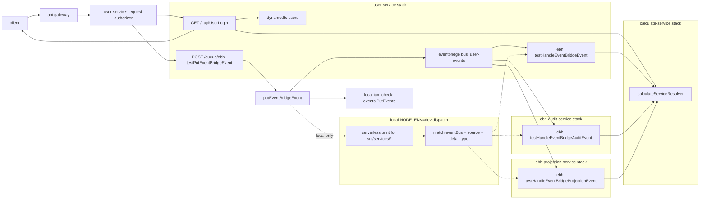

# Serverless TypeScript Boilerplate

> A clean AWS Lambda starter for building small, typed, service-oriented APIs with Serverless Framework, TypeScript, esbuild, request authorization, and Lambda-to-Lambda resolver calls.


## What This Gives You

This boilerplate is designed for fast-moving serverless projects that still need structure from day one.

- **TypeScript-first Lambda handlers** with typed request and response boundaries.
- **Serverless Framework v3** configuration written in TypeScript.
- **esbuild bundling** for small, fast Lambda artifacts.
- **API Gateway request authorizer** with JWT verification.
- **Reusable handler wrapper** that merges path params, query params, and JSON body into a single `data` object.
- **Lambda resolver pattern** for splitting API-facing handlers from internal business operations.
- **Local resolver execution** through `sls invoke local` when `NODE_ENV=dev`.
- **AWS Lambda invocation** for production resolver calls through `@aws-sdk/client-lambda`.
- **Typed AWS helpers** for SQS, SNS, EventBridge, and DynamoDB operations.
- **Typed SQS/SNS/EventBridge handlers** with local producer-to-consumer dispatch.
- **Dotenv-powered configuration** through `.env` and `serverless-dotenv-plugin`.
- **Path aliases** for cleaner imports such as `@lib/*`.

## Architecture



The API handler stays thin: it receives normalized request data, reads authenticated context, and delegates calculation work to the separate `calculate-service` Lambda. EventBridge publishing goes through the `user-events` bus; in local mode the helper scans every Serverless stack under `src/services`, finds matching EBH listeners, and invokes them from their own service roots.

## Project Structure

```text
.
├── src
│   ├── libs
│   │   ├── auth-policy.ts
│   │   ├── authorizer.ts
│   │   ├── aws-client-config.ts
│   │   ├── dynamodb.ts
│   │   ├── eventbridge-handler.ts
│   │   ├── eventbridge.ts
│   │   ├── invoke-function.ts
│   │   ├── lambda-handler.ts
│   │   ├── logger.ts
│   │   ├── serverless-local.ts
│   │   ├── sns-handler.ts
│   │   ├── sns.ts
│   │   ├── sqs-handler.ts
│   │   └── sqs.ts
│   ├── services
│   │   ├── calculate-service
│   │   │   ├── __sls
│   │   │   │   └── const.ts
│   │   │   ├── __test
│   │   │   │   └── event.json
│   │   │   ├── handlers
│   │   │   │   ├── invokers
│   │   │   │   │   └── calculate.invoker.ts
│   │   │   │   └── resolvers
│   │   │   │       └── calculate.resolver.ts
│   │   │   ├── interfaces
│   │   │   ├── serverless.ts
│   │   │   └── types
│   │   ├── ebh-audit-service
│   │   │   ├── __sls
│   │   │   │   ├── const.ts
│   │   │   │   └── roles.ts
│   │   │   ├── __test
│   │   │   │   └── ebh-event.json
│   │   │   ├── handlers
│   │   │   │   └── events
│   │   │   │       └── ebh
│   │   │   │           └── user-events-audit.ts
│   │   │   ├── interfaces
│   │   │   └── serverless.ts
│   │   ├── ebh-projection-service
│   │   │   ├── __sls
│   │   │   │   ├── const.ts
│   │   │   │   └── roles.ts
│   │   │   ├── __test
│   │   │   │   └── ebh-event.json
│   │   │   ├── handlers
│   │   │   │   └── events
│   │   │   │       └── ebh
│   │   │   │           └── user-events-projection.ts
│   │   │   ├── interfaces
│   │   │   └── serverless.ts
│   │   └── user-service
│   │       ├── __sls
│   │       │   ├── const.ts
│   │       │   ├── db.ts
│   │       │   ├── ebh.def.ts
│   │       │   ├── roles.ts
│   │       │   ├── sns.def.ts
│   │       │   ├── sqs.def.ts
│   │       │   └── tables.ts
│   │       ├── __test
│   │       │   ├── event.json
│   │       │   ├── ebh-event.json
│   │       │   ├── publish-ebh-event.json
│   │       │   ├── publish-sns-event.json
│   │       │   ├── send-sqs-event.json
│   │       │   ├── sns-event.json
│   │       │   └── sqs-event.json
│   │       ├── handlers
│   │       │   ├── api
│   │       │   │   ├── queue
│   │       │   │   │   ├── publish-ebh.ts
│   │       │   │   │   ├── publish-sns.ts
│   │       │   │   │   └── publish-sqs.ts
│   │       │   │   └── user
│   │       │   │       └── login.ts
│   │       │   └── events
│   │       │       ├── sns
│   │       │       │   └── user-events.ts
│   │       │       ├── sqs
│   │       │       │   └── user-events.ts
│   │       │       └── ebh
│   │       │           └── user-events.ts
│   │       ├── interfaces
│   │       ├── serverless.ts
│   │       └── types
│   └── sls.defaults.ts
├── .env.example
├── docker-compose.yml
├── package.json
├── tsconfig.json
└── yarn.lock
```

## Requirements

- Node.js 20+
- Yarn
- AWS credentials configured locally for deploys
- Serverless Framework dependencies installed from this project

## Quick Start

Install dependencies:

```bash
yarn install
```

Create local environment variables:

```bash
cp .env.example .env
```

This workspace already includes a local `.env` with LocalStack-friendly AWS values. Serverless loads it through `serverless-dotenv-plugin`, and the AWS helper clients also load it directly for local code paths.

Serverless commands can be run from the project root through package scripts. The scripts use `pushd` internally to execute Serverless from the requested service directory.

Invoke the calculation service locally:

```bash
yarn sls:calculate-service invoke local \
  --function calculateServiceResolver \
  --data '{"a":10,"b":25}'
```

Invoke the API handler with the sample event:

```bash
yarn sls:user-service invoke local \
  --function apiUserLogin \
  --path __test/event.json
```

## Scripts

| Script | Description |
| --- | --- |
| `yarn local:aws:up` | Start LocalStack services. Cloud resources are defined by Serverless. |
| `yarn local:aws:down` | Stop the local AWS stack. |
| `yarn local:aws:logs` | Follow LocalStack logs. |
| `yarn sls:user-service <command>` | Run any Serverless command inside `src/services/user-service`. |
| `yarn sls:user-service:print` | Print the compiled Serverless config. |
| `yarn sls:user-service:deploy` | Deploy the user service. |
| `yarn sls:user-service:remove` | Remove the user service stack. |
| `yarn sls:user-service:invoke` | Run `sls invoke local` for the user service. |
| `yarn sls:calculate-service <command>` | Run any Serverless command inside `src/services/calculate-service`. |
| `yarn sls:calculate-service:print` | Print the compiled calculate service config. |
| `yarn sls:calculate-service:deploy` | Deploy the calculate service. |
| `yarn sls:calculate-service:remove` | Remove the calculate service stack. |
| `yarn sls:calculate-service:invoke` | Run `sls invoke local` for the calculate service. |
| `yarn sls:ebh-audit-service <command>` | Run any Serverless command inside `src/services/ebh-audit-service`. |
| `yarn sls:ebh-audit-service:print` | Print the compiled EventBridge audit service config. |
| `yarn sls:ebh-audit-service:invoke` | Run `sls invoke local` for the EventBridge audit service. |
| `yarn sls:ebh-projection-service <command>` | Run any Serverless command inside `src/services/ebh-projection-service`. |
| `yarn sls:ebh-projection-service:print` | Print the compiled EventBridge projection service config. |
| `yarn sls:ebh-projection-service:invoke` | Run `sls invoke local` for the EventBridge projection service. |

## Dotenv

Environment variables live in `.env`. The committed `.env.example` documents every required key.

Serverless services use `serverless-dotenv-plugin` with `path: ../../../.env`, because service configs live under `src/services/<service>`. `src/sls.defaults.ts` also loads the same `.env` before building resources and IAM statements. Shared AWS helpers load the root `.env` before creating SDK clients.

## Infrastructure Resources

DynamoDB table names live in `__sls/tables.ts`, DynamoDB resources in `__sls/db.ts`, queue definitions in `__sls/sqs.def.ts`, topic definitions in `__sls/sns.def.ts`, EventBridge definitions in `__sls/ebh.def.ts`, shared resource logical ids in `__sls/const.ts`, and IAM permissions in `__sls/roles.ts`.

The shared `src/sls.defaults.ts` file owns common Serverless defaults through `SLS.serverless` (`frameworkVersion`, package settings, `custom`, base `provider`, and plugins). It also exposes `SLS.ddb`, `SLS.queue`, `SLS.topic`, `SLS.eventBridge`, `genApiEndpoint`, ARN builders, and IAM statement flattening, so service configs stay small and consistent:

```ts
import Aws from 'serverless/aws';
import * as SLS from '../../sls.defaults';
import { USERS_TABLE_RESOURCE } from './const';
import { USERS_TABLE } from './tables';

const db = {
    Resources: {
        ...SLS.ddb({
            name: USERS_TABLE,
            resourceName: USERS_TABLE_RESOURCE,
            key: [
                { AttributeName: 'pk', KeyType: SLS.DynamoKeyType.HASH },
                { AttributeName: 'sk', KeyType: SLS.DynamoKeyType.RANGE },
            ],
        }),
    },
} as Aws.Resources;

export default db;
```

```ts
import * as SLS from '../../sls.defaults';
import { USER_EVENTS_QUEUE_RESOURCE } from './const';

export const userEventsQueue = SLS.queue({
    name: 'user-events',
    resourceName: USER_EVENTS_QUEUE_RESOURCE,
});
```

```ts
import * as SLS from '../../sls.defaults';
import { userEventsQueue } from './sqs.def';
import { USERS_TABLE } from './tables';

export default SLS.createIamRoleStatements({
    userStore: {
        read: {
            Effect: SLS.IamEffect.ALLOW,
            Action: [SLS.IamAction.DYNAMODB_GET_ITEM, SLS.IamAction.DYNAMODB_QUERY],
            Resource: [
                SLS.makeDBArn(USERS_TABLE),
                SLS.makeDBArn(USERS_TABLE, 'index/*'),
            ],
        },
    },
    userEventsQueue: {
        send: {
            Effect: SLS.IamEffect.ALLOW,
            Action: [SLS.IamAction.SQS_SEND_MESSAGE],
            Resource: userEventsQueue.arn,
        },
    },
} satisfies SLS.IamRoleStatementGroup);
```

## Local AWS

Start local SQS, SNS, EventBridge, and DynamoDB:

```bash
yarn local:aws:up
```

When `NODE_ENV=dev`, the AWS helpers automatically use LocalStack at `http://localhost:4566` with local credentials. You can override that endpoint with `LOCAL_AWS_ENDPOINT`.

The sample queue, topic, event bus, and table are composed directly in `src/services/user-service/serverless.ts` from `db.Resources`, `userEventsQueue.def`, `userEventsTopic.def`, and `userEventsEventBus.def`. LocalStack only provides local AWS-compatible endpoints; it does not bootstrap resources through shell scripts.

`SSMAuthServiceDomain` is generated with `SLS.genApiEndpoint('user')` and stores the deployed API Gateway endpoint in SSM Parameter Store.

In local mode, `getSQS` accepts either a full queue URL or a queue name, `getSNS` accepts either a full topic ARN or a topic name, and `getEventBridge` accepts either a full event bus ARN or an event bus name.

Local producer-to-consumer dispatch is controlled by `.env` maps:

```bash
LOCAL_SQS_EVENT_HANDLERS=user-events=testHandleQueueMessage
LOCAL_SNS_EVENT_HANDLERS=user-events=testHandleTopicMessage
LOCAL_EVENTBRIDGE_EVENT_HANDLERS=
LOCAL_EVENTBRIDGE_SERVICE_ROOTS=
```

That means `testSendQueueMessage` sends to the local SQS queue and then immediately invokes `testHandleQueueMessage` with a generated `SQSEvent`. `testPublishTopicMessage` does the same for SNS. `testPutEventBridgeEvent` checks the local IAM role for `events:PutEvents`, finds every matching local `eventBridge` listener from every compiled Serverless config under `src/services`, adds any explicit `LOCAL_EVENTBRIDGE_EVENT_HANDLERS` mappings, and invokes each listener with the same generated `EventBridgeEvent`. The example intentionally has three matching EventBridge listeners across three stacks: `testHandleEventBridgeEvent` in `user-service`, `testHandleEventBridgeAuditEvent` in `ebh-audit-service`, and `testHandleEventBridgeProjectionEvent` in `ebh-projection-service`; each one invokes the calculate resolver.

Run local smoke tests:

```bash
yarn sls:user-service:invoke \
  --function testSendQueueMessage \
  --path __test/send-sqs-event.json

yarn sls:user-service:invoke \
  --function testPublishTopicMessage \
  --path __test/publish-sns-event.json

yarn sls:user-service:invoke \
  --function testPutEventBridgeEvent \
  --path __test/publish-ebh-event.json

yarn sls:user-service:invoke \
  --function testHandleQueueMessage \
  --path __test/sqs-event.json

yarn sls:user-service:invoke \
  --function testHandleTopicMessage \
  --path __test/sns-event.json

yarn sls:user-service:invoke \
  --function testHandleEventBridgeEvent \
  --path __test/ebh-event.json

yarn sls:ebh-audit-service:invoke \
  --function testHandleEventBridgeAuditEvent \
  --path __test/ebh-event.json

yarn sls:ebh-projection-service:invoke \
  --function testHandleEventBridgeProjectionEvent \
  --path __test/ebh-event.json

yarn sls:user-service:invoke \
  --function apiUserLogin \
  --path __test/event.json
```

`apiUserLogin` writes a login item into `USERS_TABLE_NAME` and reads it back before responding.

## Deploy

Deploy the calculate service first, then the user service:

```bash
yarn sls:calculate-service deploy \
  --stage dev \
  --region eu-central-1

yarn sls:user-service deploy \
  --stage dev \
  --region eu-central-1
```

Remove the deployed stacks:

```bash
yarn sls:user-service remove \
  --stage dev \
  --region eu-central-1

yarn sls:calculate-service remove \
  --stage dev \
  --region eu-central-1
```

## Environment Variables

| Variable | Required | Used By | Description |
| --- | --- | --- | --- |
| `JWT_SECRET` | Yes | `src/libs/authorizer.ts` | Secret used to verify bearer JWTs. |
| `NODE_ENV` | Local only | `src/libs/*` | Set to `dev` to use local Lambda resolver invocation and LocalStack-backed AWS clients. |
| `STAGE` | Optional | `src/services/user-service/serverless.ts` | Serverless stage. Defaults to `dev`. |
| `AWS_REGION` | AWS/runtime | AWS SDK clients | Region used by AWS clients. |
| `AWS_DEFAULT_REGION` | Local optional | Docker and AWS-compatible tools | Default region used by local AWS tooling. |
| `AWS_ACCOUNT_ID` | Local optional | `src/libs/aws-client-config.ts` | Account id used to build local SQS URLs and SNS ARNs. Defaults to `000000000000`. |
| `AWS_ACCESS_KEY_ID` | Local optional | AWS SDK clients | LocalStack access key. Defaults to `test` in dev. |
| `AWS_SECRET_ACCESS_KEY` | Local optional | AWS SDK clients | LocalStack secret key. Defaults to `test` in dev. |
| `LOCAL_AWS_ENDPOINT` | Local optional | `src/libs/aws-client-config.ts` | Shared LocalStack endpoint. Defaults to `http://localhost:4566`. |
| `SQS_ENDPOINT` | Optional | `src/libs/sqs.ts` | Custom SQS-compatible endpoint. Overrides `LOCAL_AWS_ENDPOINT` for SQS. |
| `SNS_ENDPOINT` | Optional | `src/libs/sns.ts` | Custom SNS-compatible endpoint. Overrides `LOCAL_AWS_ENDPOINT` for SNS. |
| `EVENTBRIDGE_ENDPOINT` | Optional | `src/libs/eventbridge.ts` | Custom EventBridge-compatible endpoint. Overrides `LOCAL_AWS_ENDPOINT` for EventBridge in deployed-style calls. |
| `DYNAMODB_ENDPOINT` | Optional | `src/libs/dynamodb.ts` | Custom DynamoDB-compatible endpoint. Overrides `LOCAL_AWS_ENDPOINT` for DynamoDB. |
| `DRY_RUN` | Optional | SQS, SNS, and EventBridge publishers | Set to `true` or `1` to skip publishing. |
| `USER_EVENTS_QUEUE_NAME` | Example | SQS examples | Local queue name. |
| `USER_EVENTS_QUEUE_URL` | Example | SQS examples | Full local queue URL. |
| `USER_EVENTS_QUEUE_ARN` | Example | SQS examples | Full local queue ARN. |
| `USER_EVENTS_TOPIC_NAME` | Example | SNS examples | Local topic name. |
| `USER_EVENTS_TOPIC_ARN` | Example | SNS examples | Full local topic ARN. |
| `USER_EVENTS_EVENT_BUS_NAME` | Example | EventBridge examples | Local event bus name. |
| `USER_EVENTS_EVENT_BUS_ARN` | Example | EventBridge examples | Full local event bus ARN. |
| `USERS_TABLE_NAME` | Example | DynamoDB examples and `src/services/user-service/__sls/tables.ts` | DynamoDB table name. |
| `LOCAL_SQS_EVENT_HANDLERS` | Local optional | `src/libs/sqs.ts` | Comma-separated `queueName=functionName` map for local SQS dispatch. |
| `LOCAL_SNS_EVENT_HANDLERS` | Local optional | `src/libs/sns.ts` | Comma-separated `topicName=functionName` map for local SNS dispatch. |
| `LOCAL_EVENTBRIDGE_EVENT_HANDLERS` | Local optional | `src/libs/eventbridge.ts` | Comma-separated `eventBus:source:detailType=functionName` map for extra local EventBridge dispatch targets. Matching `eventBridge` listeners are discovered from Serverless config even when this is empty. |
| `LOCAL_EVENTBRIDGE_SERVICE_ROOTS` | Local optional | `src/libs/eventbridge.ts` | Comma-separated service root list for local EventBridge discovery. Leave empty to autodiscover every Serverless service under `src/services`. |

## AWS Helpers

Publish SQS events:

```ts
import { sendMessage } from '@lib/sqs';

await sendMessage(
    process.env.USER_EVENTS_QUEUE_URL!,
    {
        userId: 'user-id',
    },
);
```

Publish SNS events:

```ts
import { publishSNS } from '@lib/sns';

await publishSNS(
    process.env.USER_EVENTS_TOPIC_ARN!,
    {
        userId: 'user-id',
    },
);
```

Publish EventBridge events:

```ts
import { putEventBridgeEvent } from '@lib/eventbridge';

await putEventBridgeEvent(
    process.env.USER_EVENTS_EVENT_BUS_NAME!,
    'user-service',
    'user.events.test',
    {
        userId: 'user-id',
    },
);
```

`sendMessage` and `publishSNS` publish one JSON payload to the provided queue or topic and still dispatch local handlers in dev mode. `sendBatchMessage` remains available for SQS batch publishing and chunks messages into AWS requests of 10 records.

Use DynamoDB with native JavaScript objects and `dynoexpr` builders:

```ts
import { getDB } from '@lib/dynamodb';

const db = getDB(process.env.USERS_TABLE_NAME!);

await db.put({
    pk: 'user-id',
    sk: 'login',
    email: 'user@example.com',
}, {
    Condition: {
        pk: 'attribute_not_exists',
    },
});

const user = await db.get({
    pk: 'user-id',
    sk: 'login',
}, {
    Projection: ['pk', 'sk', 'email'],
});

await db.update({
    pk: 'user-id',
    sk: 'login',
}, {
    Update: {
        loginCount: 'loginCount + 1',
    },
});
```

Create an SQS consumer:

```ts
import log from '@lib/logger';
import { sqsHandler } from '@lib/sqs-handler';

export const handler = sqsHandler<{ event: string }>(async ({ data, messageId }) => {
    log.info('received sqs message', {
        data,
        messageId,
    });
});
```

Create an SNS consumer:

```ts
import log from '@lib/logger';
import { snsHandler } from '@lib/sns-handler';

export const handler = snsHandler<{ event: string }>(async ({ data, messageId }) => {
    log.info('received sns message', {
        data,
        messageId,
    });
});
```

Create an EventBridge consumer:

```ts
import log from '@lib/logger';
import { eventBridgeHandler } from '@lib/eventbridge-handler';

export const handler = eventBridgeHandler<'user.events.test', { event: string }>(
    async ({ data, detailType, eventId }) => {
        log.info('received eventbridge event', {
            data,
            detailType,
            eventId,
        });
    },
);
```

## Request Flow

1. API Gateway receives the request.
2. The request authorizer reads `Authorization: Bearer <token>`.
3. A valid JWT adds `userId` to the Lambda authorizer context.
4. `lambdaHandler` normalizes request input into `{ data, ctx }`.
5. The API handler calls a typed invoker.
6. The invoker calls `calculate-service` locally in development or through AWS Lambda in deployed environments.
7. The handler returns a JSON API Gateway response.

## Adding A New Resolver

1. Add request and response types in `src/services/<service>/types`.
2. Create a resolver in `src/services/<service>/handlers/resolvers`.
3. Create an invoker in `src/services/<service>/handlers/invokers`.
4. Register the resolver in the service `serverless.ts`.
5. Call the invoker from an API handler or another resolver.

Example naming pattern:

```text
handlers/resolvers/create-user.resolver.ts
handlers/invokers/create-user.invoker.ts
functions.createUserResolver
invokeCreateUser(...)
```

## Core Conventions

- Keep API handlers focused on transport concerns.
- Put business operations behind resolver Lambdas.
- Keep shared Lambda utilities in `src/libs`.
- Keep common Serverless defaults in `src/sls.defaults.ts`.
- Keep service infrastructure resources and IAM permissions in `src/services/<service>/__sls`.
- Keep stack, function, handler, route, and resource constants in `src/services/<service>/__sls/const.ts`.
- Use path aliases for stable imports instead of long relative paths.
- Keep local test payloads in each service-local `__test` directory.

## Production Checklist

- Store `JWT_SECRET` in a secure environment variable or secret manager.
- Add least-privilege IAM permissions for Lambda-to-Lambda invocation.
- Configure per-stage values for region, environment, and stack names.
- Add CI checks for TypeScript compilation and Serverless packaging.
- Add structured logging and error reporting before handling production traffic.

## Troubleshooting

**`Service configuration is expected to be placed in a root of a service`**

Use `yarn sls:user-service <command>` from the project root, or run Serverless directly from `src/services/user-service`.

**`Compilation failed for function alias`**

Serverless handler paths are resolved relative to the service directory. Check that every `functions.*.handler` value in `serverless.ts` points to a real file from `src/services/user-service`.

## License

MIT Leroy Anders
